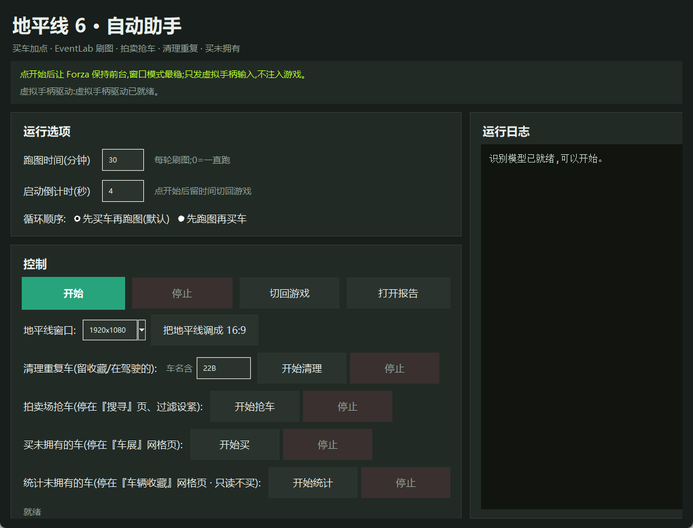

<div align="center">

# 🏁 地平线6 自动助手 · Forza Horizon 6 Helper

> **专为《极限竞速：地平线6》(Forza Horizon 6 / FH6) 打造** —— 适配日本地图、车辆专精、EventLab、车辆收藏。<br>
> **Built specifically for Forza Horizon 6 (FH6).**

**地平线6 挂机助手** — 自动买车加点、EventLab 刷图刷钱、拍卖场抢车、清理重复车、一键买光/统计未拥有的车。<br>
**Forza Horizon 6 AFK automation** — auto money/car farming, EventLab grinding, auction sniping, duplicate cleanup, buy-all / survey un-owned cars.

> **只用虚拟 Xbox 手柄 + 只读截屏识别，不注入进程、不修改任何游戏文件。**<br>
> **Virtual Xbox gamepad + read-only screen capture only — no process injection, no game-file modification.**

[](https://github.com/wenhefu/forza-horizon-6-helper/releases/latest)
[](https://github.com/wenhefu/forza-horizon-6-helper/releases)
[](https://github.com/wenhefu/forza-horizon-6-helper/stargazers)


### [⬇️ 下载最新版 / Download the latest `.exe`](https://github.com/wenhefu/forza-horizon-6-helper/releases/latest)

双击即用，无需安装 Python。 · Double-click to run, no Python needed.



</div>

---

## ✨ 功能一览 · Features

| 功能 · Feature | 说明 · What it does |
|---|---|
| **模式三循环**<br>Mode-3 farming loop | 自动买车(斯巴鲁 22B)+ 加满**车辆专精** → 导航到 EventLab 刷分赛 → 视觉刷图 → 收尾，无限循环。可选「先买车再跑图」或「先跑图再买车」；跑图时顶部显示**本轮剩余时间**倒计时；技术点耗尽自动跳过提示继续。<br>Buys a car, maxes mastery, navigates to an EventLab race, grinds by vision, loops forever. Per-round countdown box; survives skill-point-empty popups. |
| **拍卖场抢车**<br>Auction sniper | 在「搜寻」页设好车型 + 最高买断价，不停重搜，目标一出现就**买断**(**只买断、绝不竞价**)。<br>Re-searches the auction house and **buys out** your target the instant it appears — buyout only, never bids. |
| **清理重复车**<br>Duplicate cleanup | 用游戏自带「重复项」筛选批量删除多余的某型号车，自动**保留收藏的 / 正在驾驶的**，删前核对确认框。<br>Bulk-deletes duplicate cars, auto-skipping favorited / in-use ones, confirming each removal. |
| **买未拥有的车**<br>Buy all un-owned | 在车展自动勾「未拥有」筛选，一辆辆把没有的车全买下来。<br>Applies the "un-owned" filter in the autoshow and buys every missing car. |
| **统计未拥有的车** 🔎<br>Survey un-owned (read-only) | 在『车辆收藏』网格逐辆扫描未拥有的车，识别每辆的**获取方式**(车展/抽奖/季节奖励/收集簿各类别/车辆专精树/谷仓车…)并生成分组报告。**只看不买。**<br>Scans the Vehicle Collection grid and reports every un-owned car grouped by how it's obtained. **Read-only — never buys.** |
| **一键 16:9**<br>Normalize to 16:9 | 把游戏窗口规整成 16:9，让识别在任意显示器(含带鱼屏)上都稳定。<br>Snaps the game window to 16:9 so recognition is stable on any monitor. |

> 每个功能都有独立的「停止」键；数量不设上限，跑到完成或手动停为止。<br>Every feature has its own Stop button; no count caps.

---

## 🚀 快速上手 · Quick start

1. **下载并运行** [`Forza6HelperV4GUI.exe`](https://github.com/wenhefu/forza-horizon-6-helper/releases/latest)（首次约十几秒在加载识别模型）。<br>Download & run the exe (first launch takes ~15 s to load the vision models).
2. 需要 **ViGEmBus** 虚拟手柄驱动；没装程序会提示并打开下载页，装完重开。<br>Needs the **ViGEmBus** driver; the app prompts + opens the download page if it's missing.
3. 游戏用**窗口 / 无边框窗口**模式，运行时保持 Forza 在前台（失焦会自动切回）。<br>Run Forza in **windowed / borderless**, kept in the foreground (auto-refocuses).
4. **各功能起始页面 · Where to start each feature:**
   - 模式三 Mode-3 → 暂停菜单 Pause menu
   - 拍卖抢车 Auction → 拍卖场→搜索拍卖，停在「搜寻」配置页 Auction house → search config page
   - 清理重复 Dedup → 我的车辆 / 车辆标签页 My Cars / vehicle tab
   - 买未拥有 Buy un-owned → 车辆→购买车与二手车→车展网格页 Autoshow grid
   - 统计未拥有 Survey → 收集簿→旅行家→车辆收藏网格页 Collection grid

---

## 🛡️ 原理与安全 · How it works & safety

- **只发标准虚拟 Xbox 手柄输入**（通过 ViGEmBus / `vgamepad`），和你自己拿手柄按没区别。<br>Sends only standard virtual Xbox gamepad input via ViGEmBus.
- **只读截屏 + 本地识别**（YOLO ONNX 控件检测 + RapidOCR 中文识别 + 规则 + HSV 高亮掩码），**不读写游戏内存、不注入、不 hook、不修改任何游戏文件**。<br>Read-only screen capture + local vision (YOLO + OCR + rules). No memory access, no injection, no hooks, no file edits.
- 需要游戏保持前台（失焦自动切回，属正常窗口切换）；危险操作（删除/买断）一律**先核对确认框**才执行。<br>Foreground-only; destructive actions verify the confirm dialog first.

---

## 🧑‍💻 开发者 · Build from source

```powershell
# install deps into a venv, then:
.venv\Scripts\python -m PyInstaller Forza6HelperV4GUI.spec --noconfirm --clean
# -> dist\Forza6HelperV4GUI.exe

# tests (no game / gamepad needed):
.venv\Scripts\python -m pytest -q
```

技术栈 / Stack：Python · YOLO ONNX · RapidOCR · ViGEmBus(`vgamepad`) · dxcam · Tkinter。
`Forza6HelperV4GUI.spec` 的 `hiddenimports` 必须列出所有懒加载模块（`v4.*` / `v5.*`），否则冻结后崩。

---

## ⚠️ 免责声明 · Disclaimer

本工具仅供学习与研究自动化技术。使用任何游戏自动化都可能违反游戏服务条款，由此产生的一切后果（包括但不限于账号风险）由使用者自行承担。<br>
This project is for learning and research on automation. Game automation may violate the game's Terms of Service; you assume all resulting risk (including account bans).

---

<sub>关键词 / Keywords: 极限竞速地平线6 地平线6 FH6 自动 挂机 脚本 刷钱 刷车 刷信用点 拍卖 助手 · Forza Horizon 6 FH6 automation bot AFK money car farming auction sniper auto-buy helper gamepad ViGEmBus screen-reading YOLO OCR Python Windows</sub>
